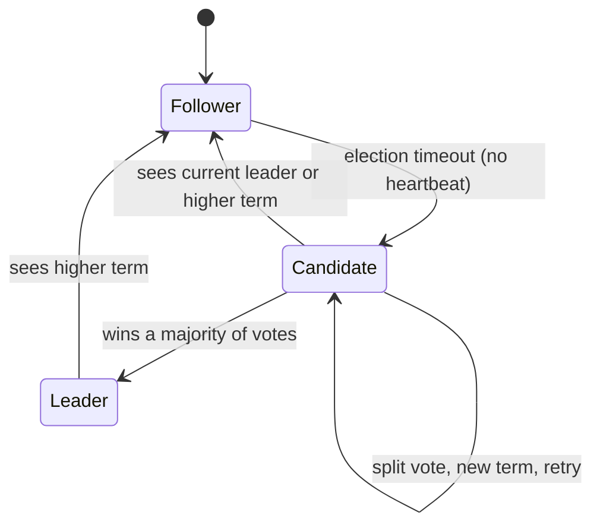
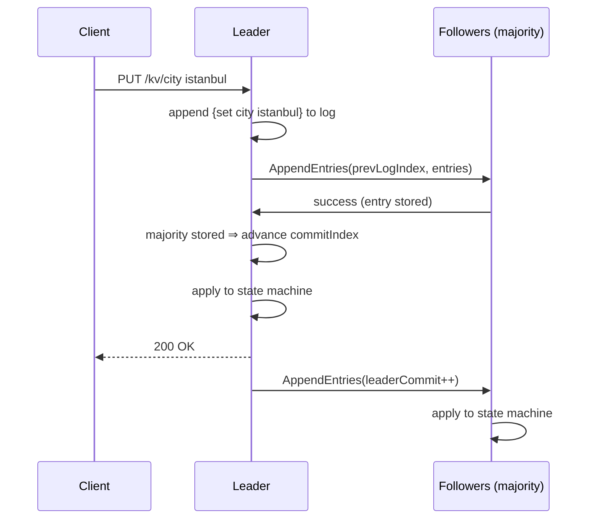

# raftkv — Raft consensus from scratch, with a replicated key-value store

A from-scratch implementation of the **Raft consensus algorithm** in Go, driving a
replicated in-memory key-value store. It implements essentially the whole protocol
from [*In Search of an Understandable Consensus Algorithm*](https://raft.github.io/raft.pdf)
(Ongaro & Ousterhout): **leader election**, **log replication**, **log compaction
via snapshotting** (§7), and **dynamic cluster membership changes** (§6) — the
safety properties that make systems like etcd, Consul and CockroachDB tick.

The emphasis is on **correctness and test quality**, not feature count. Every
safety-critical property is backed by a real, concurrent, `-race`-clean test —
including the hard ones: log reconciliation after a leader change, split-brain
prevention under a network partition, a follower catching up via a real snapshot
transfer, and a node dynamically joining a live cluster without ever being able to
disrupt it with a premature election.

- **~90% coverage on the core `raft` package** (hand-written code)
- All tests run under the Go **race detector**
- A real cluster over **gRPC**, with an **HTTP** client API — wired into Docker
  Compose *and* Kubernetes, both supporting live scale-up/down
- The same core is driven by an **in-memory transport** that injects crashes,
  partitions and latency for deterministic tests
- A real-time **lab dashboard** that observes and controls an actual running
  deployment (not a simulation) — kill/isolate/heal/add/remove a real
  container or pod from a browser and watch the cluster react live

---

## Table of contents

- [Scope](#scope)
- [Architecture](#architecture)
- [How it works](#how-it-works)
- [Quick start](#quick-start)
- [The lab: observing and controlling a real cluster](#the-lab-observing-and-controlling-a-real-cluster)
- [Failure demo: surviving a leader crash](#failure-demo-surviving-a-leader-crash)
- [Project structure & phase map](#project-structure--phase-map)
- [Testing](#testing)
- [Design decisions](#design-decisions)
- [References](#references)

---

## Scope

Started deliberately scoped to the **core** of Raft, done well, rather than the
whole paper done partially — leader election and log replication shipped first,
end to end, with real tests, before anything else was added. Log compaction and
dynamic membership were later added the same way: one safety property at a time,
each with its own real-timer, real-goroutine, `-race`-clean tests before moving on.

**Implemented**
- ✅ **Leader election** — Follower/Candidate/Leader state machine, randomized
  election timeouts, terms, the `RequestVote` RPC, the §5.4.1 up-to-date-log
  voting restriction
- ✅ **Log replication** — the `AppendEntries` RPC, the log-matching property,
  fast conflict backtracking (`ConflictIndex`/`ConflictTerm`), commit-index
  advancement by majority under the §5.4.2 current-term rule
- ✅ **Log compaction / snapshotting (§7)** — a leader (or any node) compacts its
  log past a threshold; a peer that fell behind past that point catches up via a
  real `InstallSnapshot` RPC instead of replaying history it no longer has
- ✅ **Dynamic cluster membership (§6)** — single-server add/remove, changing the
  configuration the moment an entry is *appended* (not committed), safely reverted
  if that entry is later truncated by a new leader
- ✅ **Replicated state machine** — an in-memory key-value store (`set`/`delete`/`get`)
- ✅ **Two transports** behind one interface — in-memory (tests, fault injection)
  and gRPC (real multi-process), both wired into membership changes
- ✅ **A no-op entry on election** (§8) so entries carried over from previous
  terms become applicable
- ✅ **Failure scenarios** — leader crash / continuous availability, network
  partition / split-brain prevention — provable live via the lab (below) against
  a real Docker Compose or Kubernetes deployment, not just in-process tests
- ✅ **The lab** — a real-time dashboard + control API that observes and controls
  an actual running deployment: kill/isolate/heal/add/remove a real container or
  pod and watch the cluster react

**Out of scope** (by design, to keep it focused and finished)
- ❌ Persistence to disk (everything lives in memory; a real system would persist
  the log/currentTerm/votedFor before responding to RPCs, per §5.6)
- ❌ Joint-consensus membership changes (only the simpler, still-safe
  single-server-at-a-time approach from §6 is implemented)
- ❌ Fully linearizable reads (reads are leader-only, which gives read-your-writes
  but not a ReadIndex-style linearizability barrier)

---

## Architecture

The core algorithm knows nothing about the wire. It talks to peers through a
`Transport` interface and receives RPCs through an `RPCHandler` interface. That
one seam is what makes the project both realistic (gRPC) and rigorously testable
(in-memory fault injection).

```
        client (curl / any HTTP)
                │  GET/PUT/DELETE /kv/{key}
                ▼
        ┌───────────────────┐
        │  server.Server    │  waits for commit, leader-only reads,
        │  (HTTP API)       │  redirects writes to the leader
        └─────────┬─────────┘
                  │ Submit(cmd) / ApplyCh
                  ▼
        ┌───────────────────┐        ┌──────────────────────────┐
        │  raft.Node        │───────▶│  Transport (interface)   │
        │  election +       │        ├──────────────────────────┤
        │  log replication  │◀───────│  inmem   │   grpcx (gRPC) │
        └─────────┬─────────┘  RPCs  └──────────────────────────┘
                  │ apply committed entries
                  ▼
        ┌───────────────────┐
        │  kvstore.Store    │  the replicated state machine
        └───────────────────┘
```

### Node state machine



### A write, end to end



---

## How it works

**Leader election.** Each node runs a randomized election timer. On expiry it
becomes a candidate, increments its term, votes for itself, and requests votes
from peers. A vote is granted only if the candidate's log is at least as
up-to-date as the voter's (§5.4.1). Randomized timeouts make split votes rare and
self-correcting; a winner sends heartbeats that suppress further elections.

**Log replication.** Clients' commands become log entries on the leader, which
replicates them via `AppendEntries`. Each RPC carries `prevLogIndex`/`prevLogTerm`;
a follower rejects it unless that entry matches, guaranteeing the **log-matching
property**. On rejection the follower returns a conflict hint so the leader backs
up a whole term at once instead of one index at a time. An entry **commits** once
a majority has stored it *and* it belongs to the leader's current term (§5.4.2) —
the rule that prevents a subtle data-loss race across leader changes.

**Safety under failure.** A leader stranded in a minority partition can append
entries but can never commit them, so it cannot lose data or create a second
source of truth. When it rejoins, it discovers the higher term, steps down, and
its uncommitted tail is truncated and replaced by the majority's log.

**Log compaction (§7).** An unbounded log is unrealistic, so `internal/server`
tracks how many entries have been applied since the last snapshot and, past a
threshold, asks Raft to fold everything up to that point into a snapshot of the
key-value store (`kvstore.MarshalSnapshot`) and discard the corresponding log
prefix (`Node.CompactLog`). This breaks the tidy "log index == slice position"
invariant the core previously relied on: `log[0]` becomes a *movable* sentinel
representing `(lastIncludedIndex, lastIncludedTerm)`, and every index into the
log translates through that offset. If a peer's `nextIndex` has fallen at or
before that point, the leader can no longer catch it up with ordinary
`AppendEntries` — there's nothing left to send — so it sends a real
`InstallSnapshot` RPC instead, and the peer loads the snapshot wholesale.

**Dynamic membership (§6).** Adding or removing one server at a time (never
more) guarantees the old and new configurations' majorities always overlap,
which is what makes this safe without the complexity of joint consensus. The
subtlety the paper is explicit about: a configuration change takes effect the
moment it is **appended** to a node's log — not when it commits — for both the
leader proposing it and any follower receiving it. Two correctness gaps in that
design were found and fixed *before* they could bite in production, both with
dedicated regression tests: (1) a node applying the very entry that added
*itself* must not add its own id to its own peer list; and (2) if that
append-time config change is later truncated away by a new leader's conflicting
entries, the node must revert to the configuration implied by its committed log
— otherwise it could retain a phantom peer that was never actually committed.
A joining node starts with `Config.Joining` set, which suppresses it from ever
starting an election or granting a vote until a real leader has actually made
contact — without that guard, a node with (temporarily) no known peers would
compute a quorum of one and trivially elect itself.

---

## Quick start

Requires **Go 1.25+** (developed on 1.26). The race detector additionally needs a
C toolchain (any gcc/clang; on Windows, mingw-w64).

```bash
# Run the whole test suite under the race detector
go test ./... -race

# Coverage (hand-written code)
go test ./internal/... -coverprofile=coverage.out -coverpkg=./internal/...
go tool cover -func=coverage.out | tail -1
```

### Run a live 5-node cluster

```powershell
# Windows (PowerShell)
scripts\run-cluster.ps1
```
```bash
# Linux/macOS/Git Bash
scripts/run-cluster.sh
```

Then talk to it over HTTP (any node; writes are redirected to the leader):

```bash
curl http://127.0.0.1:8001/status
curl -X PUT http://127.0.0.1:8001/kv/city -d istanbul   # -> {"status":"ok"} or a leader hint
curl http://127.0.0.1:8001/kv/city                      # -> {"key":"city","value":"istanbul"}
```

| Method | Path          | Meaning                                  |
|--------|---------------|------------------------------------------|
| GET    | `/status`     | role, term, leader, commit index         |
| GET    | `/kv/{key}`   | read a value (leader only)               |
| PUT    | `/kv/{key}`   | set value (request body = raw value)     |
| DELETE | `/kv/{key}`   | delete a key                             |

A non-leader answers writes/reads with `421 Misdirected Request` and a JSON body
naming the current leader.

### Or run it in Docker

Each node runs as its own container on a shared Docker network, finding its peers
by service name over gRPC — closer to a real deployment than five processes on one
host. The HTTP API of each node is published to a distinct host port (8001–8005).

```bash
docker compose up --build          # start the 5-node cluster
curl http://127.0.0.1:8001/status
curl -X PUT http://127.0.0.1:8001/kv/city -d istanbul

docker compose kill n1             # kill the leader's container and watch failover
curl http://127.0.0.1:8002/kv/city # the write survives on the new leader

docker compose down                # tear everything down
```

> **Note:** BuildKit can fail to build if the project lives in a path with
> non-ASCII characters. If `docker compose up --build` errors on a session
> shared-key, build once with the legacy builder and then start without building:
> `DOCKER_BUILDKIT=0 docker build -t raftkv:latest . && docker compose up -d`.

### Or run it on Kubernetes

[`deploy/k8s/raftkv.yaml`](deploy/k8s/raftkv.yaml) runs the cluster as a
**StatefulSet** behind a headless Service — the same pattern etcd itself uses in
production, because Raft peer addressing needs the stable per-pod identity and
DNS a Deployment doesn't give you. Every pod shares one identical spec: it learns
its own id from its pod name (via the downward API) and derives its peers' stable
DNS names (`raftkv-0.raftkv-headless`, `raftkv-1.raftkv-headless`, ...) from a
replica count, with no per-pod configuration
(see `k8sPeersFromEnv` in [`cmd/raftkv/main.go`](cmd/raftkv/main.go)).

```bash
# Local cluster via kind (https://kind.sigs.k8s.io/)
kind create cluster --name raftkv
scripts/k8s-deploy.sh raftkv        # builds the image, loads it into kind, applies the manifests

kubectl get pods -l app=raftkv -w
kubectl port-forward pod/raftkv-0 8001:8001 &
curl http://127.0.0.1:8001/status

# Kill the leader pod and watch the StatefulSet recreate it while the cluster
# elects a new leader and keeps serving:
scripts/demo-failover-k8s.sh
```

Captured run ([`docs/demo-failover-k8s.log`](docs/demo-failover-k8s.log)):

```
=== Waiting for a leader among the 5 pods ===
  leader = raftkv-2

=== Writing city=istanbul via raftkv-2 ===
{"key":"city","value":"istanbul"}

=== DELETING leader pod raftkv-2 (StatefulSet will recreate it) ===

=== Waiting for the cluster to elect a NEW leader ===
  new leader = raftkv-4

=== Pre-crash write survived, and a new write commits ===
{"key":"city","value":"istanbul"}
{"key":"lang","value":"go"}

=== Pods after failover ===
NAME       READY   STATUS    RESTARTS   AGE
raftkv-0   1/1     Running   0          91s
raftkv-1   1/1     Running   0          91s
raftkv-2   1/1     Running   0          45s   <- recreated by the StatefulSet
raftkv-3   1/1     Running   0          91s
raftkv-4   1/1     Running   0          91s
```

### Growing (and shrinking) the cluster live

Dynamic membership changes are wired into every deployment target. Adding a node
means: start it as a new container/pod in "join" mode (no prior peer knowledge,
so it can't disrupt the real cluster), then tell the current leader about it via
`POST /cluster/add-server` — the same conf_change mechanism `internal/raft`
implements, just automated by a script:

```bash
# Docker Compose: launch container "raftkv-n6" and admit it
scripts/compose-add-node.sh n6
# ... later, remove it (commits the removal BEFORE the container disappears)
scripts/compose-remove-node.sh n6

# Kubernetes: bump RAFTKV_REPLICAS, scale the StatefulSet by one, admit the new pod
scripts/k8s-add-node.sh
# ... later, remove the highest-ordinal pod (in that order — commit, then scale down)
scripts/k8s-remove-node.sh
```

Verified against a real 5→6→5 kind cluster: `raftkv-5` joined, converged to the
same commit index as the original 5 pods with zero disruption to them (a
`kubectl set env` template change would ordinarily trigger a StatefulSet
rolling *restart* of every existing pod — avoided with `updateStrategy:
OnDelete` in [`deploy/k8s/raftkv.yaml`](deploy/k8s/raftkv.yaml)), then was
cleanly removed again, shrinking back to 5.

---

## The lab: observing and controlling a real cluster

`cmd/raftlab` is a real-time dashboard and control API for a **real** running
Docker-Compose or Kubernetes deployment — not a simulation. It tails each node's
existing log output to stream live Raft events over a WebSocket, polls each
node's `/status` and `/debug/log` to render a node topology and a per-index log
matrix (committed / uncommitted / compacted / absent), and its buttons call
through to `docker kill`/`docker network disconnect`/`kubectl delete pod`/a
scoped `NetworkPolicy`/the add-node and remove-node scripts above — so killing a
node in the browser kills a real container or pod.

```bash
docker compose up -d              # (or: apply the k8s manifests + kind cluster)
scripts/run-lab.sh --target=compose    # or --target=k8s
# open http://127.0.0.1:7070
```

Because the lab controls real infrastructure rather than simulating it, its
day-to-day correctness is proven the same way the failure demos above are —
by actually running it (`scripts/demo-lab.sh`) — while what *is* practical to
unit-test (command construction for every orchestrator action, the WebSocket
fan-out, the log-line parser) has its own `go test` coverage in
`internal/orchestrator/{compose,k8s}` and `internal/lab`.

Three real bugs surfaced only by testing this against a live cluster, not by
unit tests alone — worth calling out explicitly since it's the whole reason
"verify manually, don't just trust the code" is part of this project's process:
1. A `docker ps --filter name=^raftkv-` search for dynamically-added nodes
   matched an unrelated container that happened to share the prefix (this
   machine's own kind Kubernetes cluster, named `raftkv-control-plane`) — fixed
   by also filtering on Docker network membership.
2. Compose does **not** name a container after its bare service name; `docker
   kill n2`/`docker logs n2` silently fail with "no such container" against the
   real name (`<project>-<service>-<replica>`, e.g. `raft_konsenss-n2-1`) —
   fixed by resolving (and caching) the real name via `docker compose ps`.
3. `internal/logfmt.Parse` never matched a single real log line: `cmd/raftkv`
   prints events through a standard `log.Logger` that prepends a timestamp,
   which the in-isolation round-trip test (`Format` then `Parse`, no
   `log.Logger` involved) never exercised — fixed by relaxing the regex's
   leading anchor, with a new regression test using an actual timestamped line.

---

## Failure demo: surviving a leader crash

`scripts/demo-failover.ps1` starts a real 5-process cluster, writes a value, then
**kills the leader process** and shows the cluster elect a new leader and keep
serving — with the pre-crash write still intact. Captured run
([`docs/demo-failover.log`](docs/demo-failover.log); exact node ids and term
numbers vary per run):

```
=== Waiting for leader election ===
  leader = n5  (term 5)

=== Writing city=istanbul via leader n5 ===
  read back: city = istanbul

=== KILLING leader n5 (pid 42204) ===
  leader process terminated

=== Waiting for the cluster to elect a NEW leader ===
  new leader = n1  (term 6)

=== Cluster still serving: pre-crash write survived, and a new write commits ===
  city (written before crash) = istanbul
  lang (written after crash)  = go

=== Final status of all live nodes ===
  n1: role=Leader    term=6 leader=n1 commit=4
  n2: role=Follower  term=6 leader=n1 commit=3
  n3: role=Follower  term=6 leader=n1 commit=3
  n4: role=Follower  term=6 leader=n1 commit=3
  n5: (down)
```

Split-brain prevention (only the majority commits; the minority's write fails;
after healing, the minority adopts the majority's log) is proved deterministically
by `TestPartitionSplitBrainPrevention` and `TestLogReconciliationAfterLeaderChange`.

---

## Project structure & phase map

The project was built in twelve reviewable phases (one commit each — see `git
log` for the exact history and per-phase test lists).

| Phase | Focus | Key files |
|------|-------|-----------|
| **1** | Leader election | [`internal/raft/raft.go`](internal/raft/raft.go), [`election.go`](internal/raft/election.go), [`handlers.go`](internal/raft/handlers.go) |
| **2** | Log replication | [`internal/raft/replication.go`](internal/raft/replication.go), [`apply.go`](internal/raft/apply.go), [`log.go`](internal/raft/log.go) |
| **3** | State machine, client API, gRPC | [`internal/kvstore/`](internal/kvstore/), [`internal/server/`](internal/server/), [`internal/transport/grpcx/`](internal/transport/grpcx/), [`cmd/raftkv/`](cmd/raftkv/) |
| **4** | Failure scenarios & demo | [`internal/server/failure_test.go`](internal/server/failure_test.go), [`scripts/demo-failover.ps1`](scripts/demo-failover.ps1) |
| **5** | Documentation | this README, [`docs/`](docs/) |
| — | Docker, then Kubernetes deployment | [`Dockerfile`](Dockerfile), [`docker-compose.yml`](docker-compose.yml), [`deploy/k8s/`](deploy/k8s/) |
| **6** | Log compaction / snapshotting | [`internal/raft/snapshot.go`](internal/raft/snapshot.go), the offset-translation rewrite across [`log.go`](internal/raft/log.go)/[`replication.go`](internal/raft/replication.go)/[`handlers.go`](internal/raft/handlers.go)/[`apply.go`](internal/raft/apply.go) |
| **7**\* | Snapshotting → gRPC | [`internal/transport/grpcx/`](internal/transport/grpcx/) (`InstallSnapshot` RPC) |
| **8** | Dynamic membership (core) | [`internal/raft/membership.go`](internal/raft/membership.go) |
| **9** | Membership → gRPC + HTTP | `PeerManager` in [`transport.go`](internal/raft/transport.go)/[`grpcx.go`](internal/transport/grpcx/grpcx.go), `/cluster/*` in [`internal/server/http.go`](internal/server/http.go) |
| **10** | Membership → Docker Compose + Kubernetes | [`scripts/compose-add-node.sh`](scripts/compose-add-node.sh), [`scripts/k8s-add-node.sh`](scripts/k8s-add-node.sh), `-join` in [`cmd/raftkv/main.go`](cmd/raftkv/main.go) |
| **11** | Lab backend | [`internal/orchestrator/`](internal/orchestrator/), [`internal/lab/`](internal/lab/), [`internal/logfmt/`](internal/logfmt/) |
| **12** | Lab frontend, launchers, docs | [`cmd/raftlab/web/`](cmd/raftlab/web/), [`scripts/run-lab.sh`](scripts/run-lab.sh), this README |

\* *Phase 7 was committed together with Phase 6: `Transport`/`RPCHandler` are
shared interfaces, so adding `InstallSnapshot` broke every implementer's build
at once — there was no way to land the core change without the gRPC side.*

```
internal/
  raft/            core algorithm (transport-agnostic)
    raft.go            Node, config, main loop, role transitions
    election.go        RequestVote fan-out, becoming leader
    replication.go      AppendEntries fan-out, conflict backtracking, snapshot handoff
    handlers.go         inbound RequestVote / AppendEntries
    apply.go            Submit, commit-index advancement, apply loop
    log.go              log helpers, logical-index ↔ slice-offset translation
    snapshot.go          CompactLog, HandleInstallSnapshot, InstallSnapshot send/apply
    membership.go        ProposeConfigChange, append-time effect, truncation reversion
    status.go            observable state snapshots
    transport.go          Transport / RPCHandler / PeerManager interfaces
  kvstore/         the replicated state machine (+ snapshot marshal/restore)
  server/          binds Raft to the store; HTTP client + cluster API; snapshot policy
  transport/
    inmem/             in-process transport w/ crash & partition injection
    grpcx/             gRPC transport (+ generated raftpb)
  logfmt/          shared Event line format (producer: cmd/raftkv, consumer: internal/lab)
  orchestrator/
    compose/           drives a docker-compose deployment
    k8s/               drives a Kubernetes StatefulSet deployment
  lab/             the lab's HTTP+WebSocket control-plane server
cmd/
  raftkv/          one cluster node (gRPC peers + HTTP API)
  raftlab/         the lab: control-plane server + embedded dashboard frontend
deploy/k8s/      StatefulSet + headless Service manifest
scripts/         run-cluster.{ps1,sh}, demo-failover.{ps1,sh}, k8s-deploy.sh,
                 compose-add-node.sh, compose-remove-node.sh,
                 k8s-add-node.sh, k8s-remove-node.sh,
                 run-lab.sh, demo-lab.sh
```

---

## Testing

The interesting failure modes in Raft are timing- and concurrency-dependent, so
tests use **real goroutines and real timers** (no mocked time), and all run under
`go test -race`.

| Test | What it proves |
|------|----------------|
| `TestElectSingleLeader` | exactly one leader is elected from a cold start |
| `TestReElectionAfterLeaderFailure` | a crashed leader is replaced, in a higher term |
| `TestRejoinedLeaderStepsDown` | a partitioned old leader steps down (no split brain) |
| `TestLeaderStabilityNoSpuriousElections` | heartbeats suppress needless elections |
| `TestLogReplicationBasic` | commands replicate and apply in identical order everywhere |
| `TestFollowerCatchUp` | a reconnected follower catches up automatically |
| `TestLogReconciliationAfterLeaderChange` | divergent tails reconcile; orphans are discarded |
| `TestNoCommitWithoutMajority` | a minority leader can never advance its commit index |
| `TestStateMachineConvergence` | all replicas reach identical state |
| `TestWriteSurvivesLeaderChange` | committed writes are durable across failover |
| `TestClusterAvailableAcrossLeaderCrash` | the cluster keeps serving through a crash |
| `TestPartitionSplitBrainPrevention` | partitions cannot cause split-brain |
| `TestGRPCElectionAndReplication` | the real gRPC/TCP transport works end to end |
| `TestSnapshot_LeaderCompactsAndFollowerCatchesUp` | a far-behind follower catches up via a real `InstallSnapshot` |
| `TestSnapshot_InterleavesWithNormalReplication` | compacting one node doesn't disturb ordinary replication among the rest |
| `TestSnapshot_ConcurrentCompactionRaceFree` | concurrent `Submit` + repeated compaction is `-race`-clean |
| `TestBackoffFallsThroughPastCompactedPrefix` | backoff scanning past a compacted prefix correctly triggers a snapshot, not a panic |
| `TestGRPCInstallSnapshotCatchUp` | `InstallSnapshot` works over a real gRPC/TCP socket, not just in-memory |
| `TestMembership_AddServerCatchesUpAndParticipates` | a dynamically-added node catches up and votes/commits normally afterward |
| `TestMembership_RemoveServerAdjustsQuorum` | removing a server actually shrinks the quorum required to commit |
| `TestMembership_RejectsConcurrentChange` | a second in-flight membership change is rejected, not silently queued |
| `TestMembership_JoiningNodeDoesNotSelfElect` | a joining node with no peers never starts an election or advances its term |
| `TestMembership_UncommittedConfigChangeRevertedOnTruncation` | a truncated, never-committed config change leaves no phantom peer |
| `TestApplyConfigChangeNeverAddsSelf` | a node processing the entry that added it never adds its own id to its peers |
| `TestGRPCAddServerCatchesUpOverRealNetwork` | dynamic membership over real gRPC, not just in-memory |
| `TestFormatParseRoundTrip` / `TestParseHandlesRealLogLoggerPrefix` | the lab's event-line format survives an actual `log.Logger`, not just in-isolation |

Coverage (hand-written code, excluding generated protobuf and the orchestrator/lab
packages that need a live deployment to fully exercise — see
[The lab](#the-lab-observing-and-controlling-a-real-cluster) for how those are verified instead):

| Package | Coverage |
|---------|----------|
| `internal/raft` (core) | **90%** |
| `internal/kvstore` | 97% |
| `internal/server` | 88% |
| `internal/logfmt` | 95% |
| `internal/transport/inmem` | 85% |
| `internal/transport/grpcx` | 75% |
| `internal/orchestrator/compose` | 64%\* |
| `internal/orchestrator/k8s` | 47%\* |
| `internal/lab` | 23%\* |

\* *These three packages are mostly thin `os/exec` wrappers around
docker/kubectl; what's practical to unit-test (command construction, via an
injected `exec.Command` spy) is tested — real infrastructure behavior is
verified live instead (see [The lab](#the-lab-observing-and-controlling-a-real-cluster)).*

---

## Design decisions

- **Transport as an interface.** The core `raft.Node` depends only on `Transport`
  and `RPCHandler`. The in-memory transport makes tests deterministic and lets
  them inject crashes (`Isolate`), partitions (`Partition`) and latency; gRPC runs
  the same code across processes. This is the single most important structural
  choice — it is what makes the split-brain and reconciliation tests possible.
- **A single mutex, and no RPCs under lock.** All mutable node state is guarded by
  one mutex; network fan-out always happens after releasing it. Vote/replication
  replies are re-validated against the current term when they return, so stale
  responses can't corrupt state.
- **No-op on election (§8).** A new leader appends a no-op entry for its term so
  that committing it transitively commits (and makes applicable) entries inherited
  from earlier terms — without it, a just-elected leader can hold committed-but-
  unapplied data it cannot yet serve.
- **Fast conflict backtracking.** Rejected `AppendEntries` carry a conflict term
  and index so the leader rewinds a whole term per round trip instead of one entry.
- **Leader-only reads.** Reads are served only by the leader for read-your-writes
  behavior. Full linearizability would add a ReadIndex heartbeat barrier — noted,
  and out of scope here.
- **A single non-chunked `InstallSnapshot` RPC.** The paper's offset/`done`
  streaming design exists for state machines too large for one RPC message;
  this project's is a `map[string]string`, so streaming would add real
  complexity for a problem this project doesn't have. Documented as a
  deliberate simplification, not a correctness gap in anything actually
  exercised.
- **Single-server membership changes, not joint consensus.** Changing the
  configuration one server at a time guarantees the old and new majorities
  always overlap — the paper's simpler, later-recommended alternative to full
  joint consensus, and enough for what this project needs to demonstrate.
- **Config changes take effect on log append, not commit (§6).** This is the
  one subtlety that, if missed, would let a newly-added peer's address never
  reach the leader's replication loop in time, or let a removed peer keep
  being replicated to indefinitely. Two related correctness gaps — a node
  adding its own id to its own peer list, and a truncated config change
  leaving a phantom peer behind — were found during design review and fixed
  before being implemented, each with its own regression test (see
  [How it works](#how-it-works)).
- **The lab talks to real infrastructure through one interface, two
  implementations.** `internal/orchestrator`'s `Orchestrator` mirrors
  `Transport`'s inmem/grpcx split exactly: one contract, a Docker-Compose
  implementation and a Kubernetes implementation, so the dashboard and its
  logic are written once. Three real bugs in that layer — a name-only
  container filter matching unrelated infrastructure, Compose's real container
  names not being its bare service names, and a log-line parser that never
  actually matched a real, timestamp-prefixed log line — were caught only by
  running it against a live cluster, not by unit tests, which is exactly why
  the project treats "run it for real" as a required step, not an optional
  extra (see [The lab](#the-lab-observing-and-controlling-a-real-cluster)).

---

## References

- Diego Ongaro and John Ousterhout, *In Search of an Understandable Consensus
  Algorithm (Extended Version)*, 2014 — <https://raft.github.io/raft.pdf>
- The Raft website and visualization — <https://raft.github.io/>
