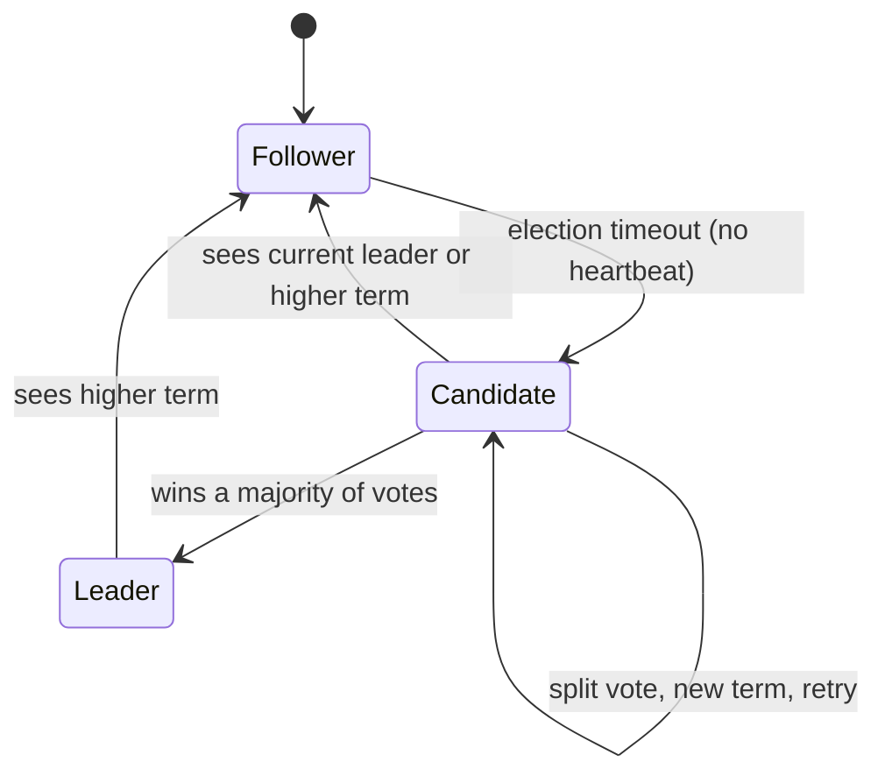
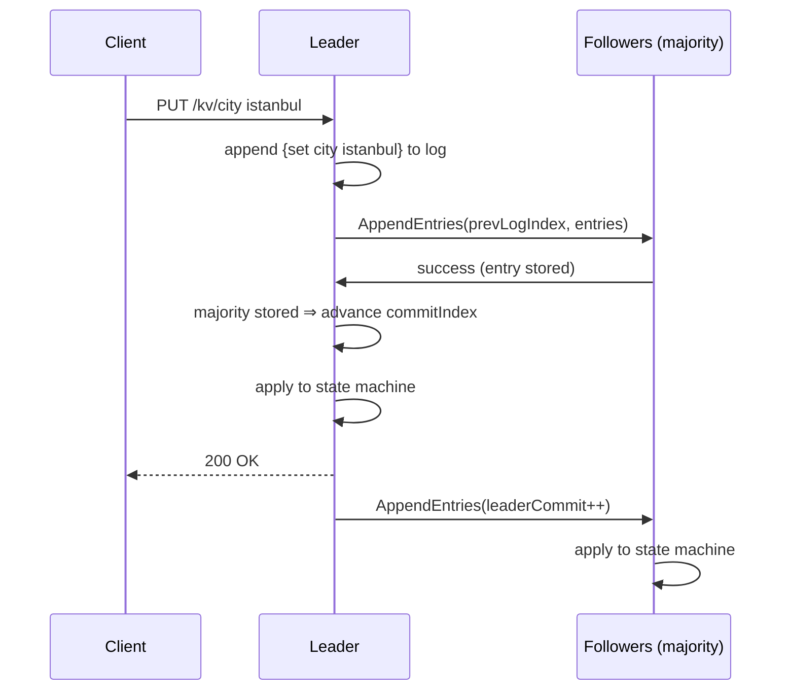

# raftkv — Raft consensus from scratch, with a replicated key-value store

A from-scratch implementation of the **Raft consensus algorithm** in Go, driving a
replicated in-memory key-value store. It implements the core protocol from
[*In Search of an Understandable Consensus Algorithm*](https://raft.github.io/raft.pdf)
(Ongaro & Ousterhout): **leader election** and **log replication**, with the
safety properties that make systems like etcd, Consul and CockroachDB tick.

The emphasis is on **correctness and test quality**, not feature count. Every
safety-critical property is backed by a real, concurrent, `-race`-clean test —
including the hard ones: log reconciliation after a leader change, and split-brain
prevention under a network partition.

- **~82% statement coverage** (hand-written code), **88% on the core `raft` package**
- All tests run under the Go **race detector**
- A real **5-process cluster** over **gRPC**, with an **HTTP** client API
- The same core is driven by an **in-memory transport** that injects crashes,
  partitions and latency for deterministic tests

---

## Table of contents

- [Scope](#scope)
- [Architecture](#architecture)
- [How it works](#how-it-works)
- [Quick start](#quick-start)
- [Failure demo: surviving a leader crash](#failure-demo-surviving-a-leader-crash)
- [Project structure & phase map](#project-structure--phase-map)
- [Testing](#testing)
- [Design decisions](#design-decisions)
- [References](#references)

---

## Scope

Deliberately scoped to the **core** of Raft, done well, rather than the whole
paper done partially.

**Implemented**
- ✅ **Leader election** — Follower/Candidate/Leader state machine, randomized
  election timeouts, terms, the `RequestVote` RPC, the §5.4.1 up-to-date-log
  voting restriction
- ✅ **Log replication** — the `AppendEntries` RPC, the log-matching property,
  fast conflict backtracking (`ConflictIndex`/`ConflictTerm`), commit-index
  advancement by majority under the §5.4.2 current-term rule
- ✅ **Replicated state machine** — an in-memory key-value store (`set`/`delete`/`get`)
- ✅ **Two transports** behind one interface — in-memory (tests, fault injection)
  and gRPC (real multi-process)
- ✅ **A no-op entry on election** (§8) so entries carried over from previous
  terms become applicable
- ✅ **Failure scenarios** — leader crash / continuous availability, network
  partition / split-brain prevention

**Out of scope** (by design, to keep it focused and finished)
- ❌ Log compaction / snapshotting
- ❌ Dynamic cluster membership changes (adding/removing nodes)
- ❌ Deployment across real, separate servers (a single-machine multi-process
  cluster is used; latency and partitions are simulated)

---

## Architecture

The core algorithm knows nothing about the wire. It talks to peers through a
`Transport` interface and receives RPCs through an `RPCHandler` interface. That
one seam is what makes the project both realistic (gRPC) and rigorously testable
(in-memory fault injection).

```
        client (curl / any HTTP)
                │  GET/PUT/DELETE /kv/{key}
                ▼
        ┌───────────────────┐
        │  server.Server    │  waits for commit, leader-only reads,
        │  (HTTP API)       │  redirects writes to the leader
        └─────────┬─────────┘
                  │ Submit(cmd) / ApplyCh
                  ▼
        ┌───────────────────┐        ┌──────────────────────────┐
        │  raft.Node        │───────▶│  Transport (interface)   │
        │  election +       │        ├──────────────────────────┤
        │  log replication  │◀───────│  inmem   │   grpcx (gRPC) │
        └─────────┬─────────┘  RPCs  └──────────────────────────┘
                  │ apply committed entries
                  ▼
        ┌───────────────────┐
        │  kvstore.Store    │  the replicated state machine
        └───────────────────┘
```

### Node state machine



### A write, end to end



---

## How it works

**Leader election.** Each node runs a randomized election timer. On expiry it
becomes a candidate, increments its term, votes for itself, and requests votes
from peers. A vote is granted only if the candidate's log is at least as
up-to-date as the voter's (§5.4.1). Randomized timeouts make split votes rare and
self-correcting; a winner sends heartbeats that suppress further elections.

**Log replication.** Clients' commands become log entries on the leader, which
replicates them via `AppendEntries`. Each RPC carries `prevLogIndex`/`prevLogTerm`;
a follower rejects it unless that entry matches, guaranteeing the **log-matching
property**. On rejection the follower returns a conflict hint so the leader backs
up a whole term at once instead of one index at a time. An entry **commits** once
a majority has stored it *and* it belongs to the leader's current term (§5.4.2) —
the rule that prevents a subtle data-loss race across leader changes.

**Safety under failure.** A leader stranded in a minority partition can append
entries but can never commit them, so it cannot lose data or create a second
source of truth. When it rejoins, it discovers the higher term, steps down, and
its uncommitted tail is truncated and replaced by the majority's log.

---

## Quick start

Requires **Go 1.25+** (developed on 1.26). The race detector additionally needs a
C toolchain (any gcc/clang; on Windows, mingw-w64).

```bash
# Run the whole test suite under the race detector
go test ./... -race

# Coverage (hand-written code)
go test ./internal/... -coverprofile=coverage.out -coverpkg=./internal/...
go tool cover -func=coverage.out | tail -1
```

### Run a live 5-node cluster

```powershell
# Windows (PowerShell)
scripts\run-cluster.ps1
```
```bash
# Linux/macOS/Git Bash
scripts/run-cluster.sh
```

Then talk to it over HTTP (any node; writes are redirected to the leader):

```bash
curl http://127.0.0.1:8001/status
curl -X PUT http://127.0.0.1:8001/kv/city -d istanbul   # -> {"status":"ok"} or a leader hint
curl http://127.0.0.1:8001/kv/city                      # -> {"key":"city","value":"istanbul"}
```

| Method | Path          | Meaning                                  |
|--------|---------------|------------------------------------------|
| GET    | `/status`     | role, term, leader, commit index         |
| GET    | `/kv/{key}`   | read a value (leader only)               |
| PUT    | `/kv/{key}`   | set value (request body = raw value)     |
| DELETE | `/kv/{key}`   | delete a key                             |

A non-leader answers writes/reads with `421 Misdirected Request` and a JSON body
naming the current leader.

---

## Failure demo: surviving a leader crash

`scripts/demo-failover.ps1` starts a real 5-process cluster, writes a value, then
**kills the leader process** and shows the cluster elect a new leader and keep
serving — with the pre-crash write still intact. Captured run
([`docs/demo-failover.log`](docs/demo-failover.log)):

```
=== Waiting for leader election ===
  leader = n3  (term 1)

=== Writing city=istanbul via leader n3 ===
  read back: city = istanbul

=== KILLING leader n3 (pid 36888) ===
  leader process terminated

=== Waiting for the cluster to elect a NEW leader ===
  new leader = n1  (term 2)

=== Cluster still serving: pre-crash write survived, and a new write commits ===
  city (written before crash) = istanbul
  lang (written after crash)  = go

=== Final status of all live nodes ===
  n1: role=Leader    term=2 leader=n1 commit=4
  n2: role=Follower  term=2 leader=n1 commit=3
  n3: (down)
  n4: role=Follower  term=2 leader=n1 commit=4
  n5: role=Follower  term=2 leader=n1 commit=4
```

Split-brain prevention (only the majority commits; the minority's write fails;
after healing, the minority adopts the majority's log) is proved deterministically
by `TestPartitionSplitBrainPrevention` and `TestLogReconciliationAfterLeaderChange`.

---

## Project structure & phase map

The project was built in five reviewable phases (one commit each).

| Phase | Focus | Key files |
|------|-------|-----------|
| **1** | Leader election | [`internal/raft/raft.go`](internal/raft/raft.go), [`election.go`](internal/raft/election.go), [`handlers.go`](internal/raft/handlers.go) |
| **2** | Log replication | [`internal/raft/replication.go`](internal/raft/replication.go), [`apply.go`](internal/raft/apply.go), [`log.go`](internal/raft/log.go) |
| **3** | State machine, client API, gRPC | [`internal/kvstore/`](internal/kvstore/), [`internal/server/`](internal/server/), [`internal/transport/grpcx/`](internal/transport/grpcx/), [`cmd/raftkv/`](cmd/raftkv/) |
| **4** | Failure scenarios & demo | [`internal/server/failure_test.go`](internal/server/failure_test.go), [`scripts/demo-failover.ps1`](scripts/demo-failover.ps1) |
| **5** | Documentation | this README, [`docs/`](docs/) |

```
internal/
  raft/          core algorithm (transport-agnostic)
    raft.go          Node, config, main loop, role transitions
    election.go      RequestVote fan-out, becoming leader
    replication.go   AppendEntries fan-out, conflict backtracking
    handlers.go      inbound RequestVote / AppendEntries
    apply.go         Submit, commit-index advancement, apply loop
    log.go           log helpers, up-to-date check
    status.go        observable state snapshots
  kvstore/       the replicated state machine
  server/        binds Raft to the store; HTTP client API
  transport/
    inmem/           in-process transport w/ crash & partition injection
    grpcx/           gRPC transport (+ generated raftpb)
cmd/raftkv/      one cluster node (gRPC peers + HTTP API)
scripts/         run-cluster.{ps1,sh}, demo-failover.ps1
```

---

## Testing

The interesting failure modes in Raft are timing- and concurrency-dependent, so
tests use **real goroutines and real timers** (no mocked time), and all run under
`go test -race`.

| Test | What it proves |
|------|----------------|
| `TestElectSingleLeader` | exactly one leader is elected from a cold start |
| `TestReElectionAfterLeaderFailure` | a crashed leader is replaced, in a higher term |
| `TestRejoinedLeaderStepsDown` | a partitioned old leader steps down (no split brain) |
| `TestLeaderStabilityNoSpuriousElections` | heartbeats suppress needless elections |
| `TestLogReplicationBasic` | commands replicate and apply in identical order everywhere |
| `TestFollowerCatchUp` | a reconnected follower catches up automatically |
| `TestLogReconciliationAfterLeaderChange` | divergent tails reconcile; orphans are discarded |
| `TestNoCommitWithoutMajority` | a minority leader can never advance its commit index |
| `TestStateMachineConvergence` | all replicas reach identical state |
| `TestWriteSurvivesLeaderChange` | committed writes are durable across failover |
| `TestClusterAvailableAcrossLeaderCrash` | the cluster keeps serving through a crash |
| `TestPartitionSplitBrainPrevention` | partitions cannot cause split-brain |
| `TestGRPCElectionAndReplication` | the real gRPC/TCP transport works end to end |

Coverage (hand-written code, excluding generated protobuf):

| Package | Coverage |
|---------|----------|
| `internal/raft` (core) | **88%** |
| `internal/kvstore` | 100% |
| `internal/transport/inmem` | 85% |
| `internal/transport/grpcx` | 76% |
| `internal/server` | 64% |
| **total** | **~82%** |

---

## Design decisions

- **Transport as an interface.** The core `raft.Node` depends only on `Transport`
  and `RPCHandler`. The in-memory transport makes tests deterministic and lets
  them inject crashes (`Isolate`), partitions (`Partition`) and latency; gRPC runs
  the same code across processes. This is the single most important structural
  choice — it is what makes the split-brain and reconciliation tests possible.
- **A single mutex, and no RPCs under lock.** All mutable node state is guarded by
  one mutex; network fan-out always happens after releasing it. Vote/replication
  replies are re-validated against the current term when they return, so stale
  responses can't corrupt state.
- **No-op on election (§8).** A new leader appends a no-op entry for its term so
  that committing it transitively commits (and makes applicable) entries inherited
  from earlier terms — without it, a just-elected leader can hold committed-but-
  unapplied data it cannot yet serve.
- **Fast conflict backtracking.** Rejected `AppendEntries` carry a conflict term
  and index so the leader rewinds a whole term per round trip instead of one entry.
- **Leader-only reads.** Reads are served only by the leader for read-your-writes
  behavior. Full linearizability would add a ReadIndex heartbeat barrier — noted,
  and out of scope here.

---

## References

- Diego Ongaro and John Ousterhout, *In Search of an Understandable Consensus
  Algorithm (Extended Version)*, 2014 — <https://raft.github.io/raft.pdf>
- The Raft website and visualization — <https://raft.github.io/>
